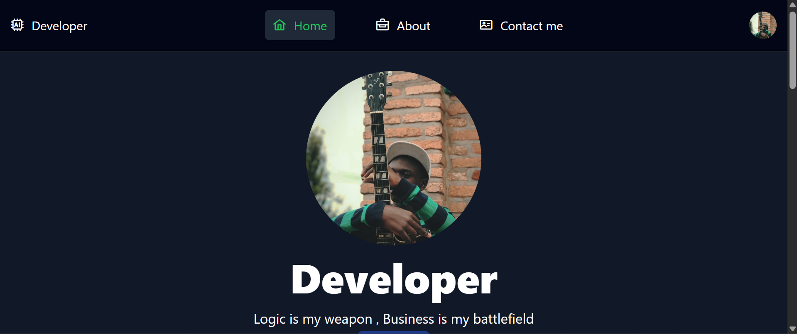
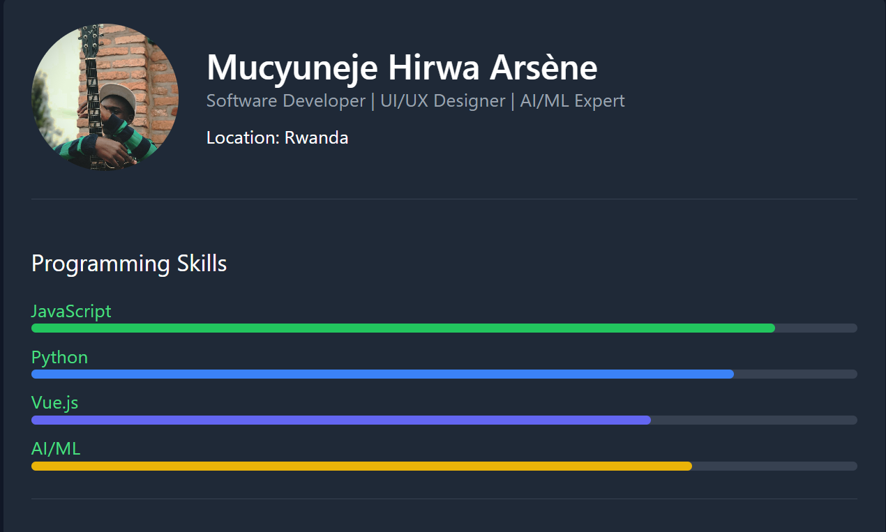

# 💼 Mucyuneje Hirwa Arsene – Portfolio

Welcome to my personal portfolio website! This project showcases who I am, what I build, and what I care about as a full-stack developer and AI engineer.

## 🚀 About Me

I’m a passionate **Full-Stack Developer** and **AI Engineer** with a creative eye for design and a strong love for data-driven applications. I specialize in building smart systems for schools, trading, and more.

- 🔧 Backend: Node.js, Express, Python
- 🎨 Frontend: Next.js, Vue.js, Tailwind CSS, shadcn/ui
- 🧠 AI: Technical analysis, pattern detection, and gold price prediction
- 🗃️ Database: MySQL, PlanetScale

## 🖥️ Live Demo

👉 [Visit My Portfolio](https://mucyuneje.netlify.app)

## 📸 Screenshots

| Homepage | Project Section |
|---------|------------------|
|  |  |

## 🔧 Features

- Responsive design with Tailwind CSS
- Clean, modern UI with shadcn/ui
- Showcases my SaaS projects, AI tools, and trading apps
- Contact form with email support
- Fully deployable on Vercel or Netlify

## 🛠️ Tech Stack

| Tech            | Description                     |
|-----------------|---------------------------------|
| **Next.js**     | React framework for frontend    |
| **Tailwind CSS**| Styling and responsive UI       |
| **Node.js**     | Backend for APIs and logic      |
| **MySQL**       | Database for storing data       |
| **Resend**      | Email service for contact form  |

## 🧪 Setup Instructions

1. Clone the repository:
   ```bash
   git clone https://github.com/mucyuneje/Portifolio.git
   cd Portifolio
